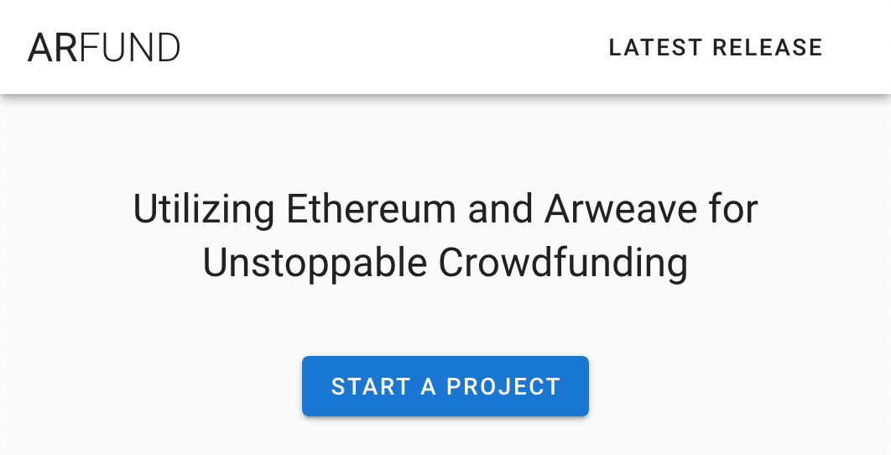
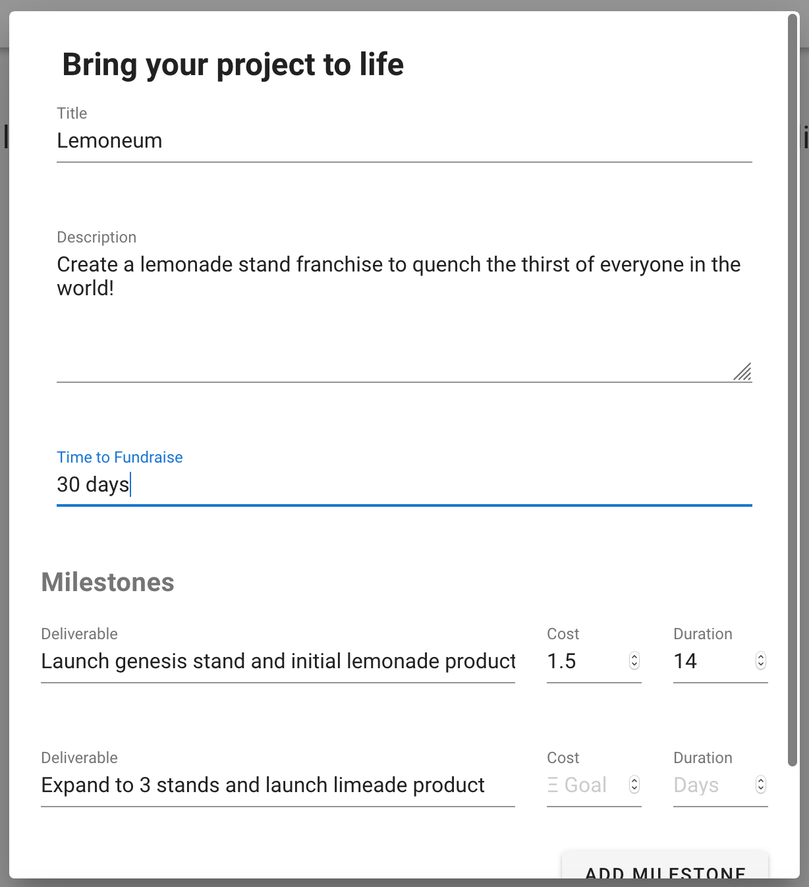
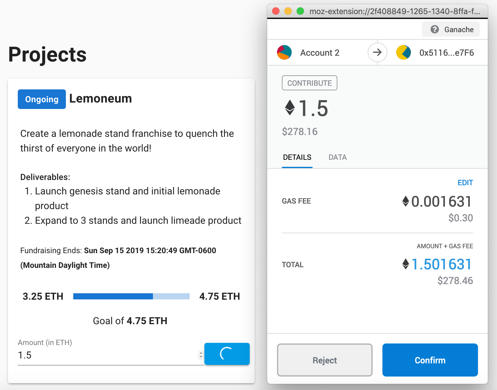
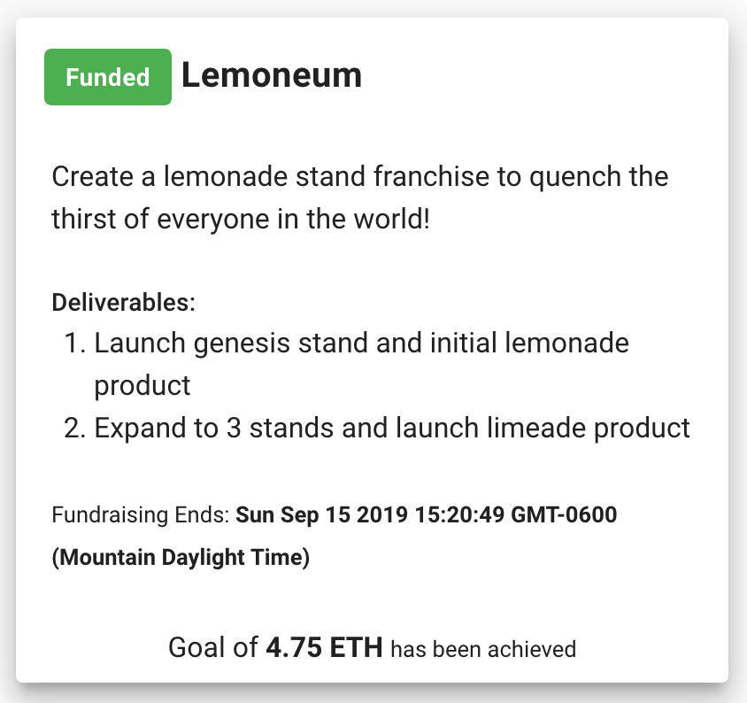
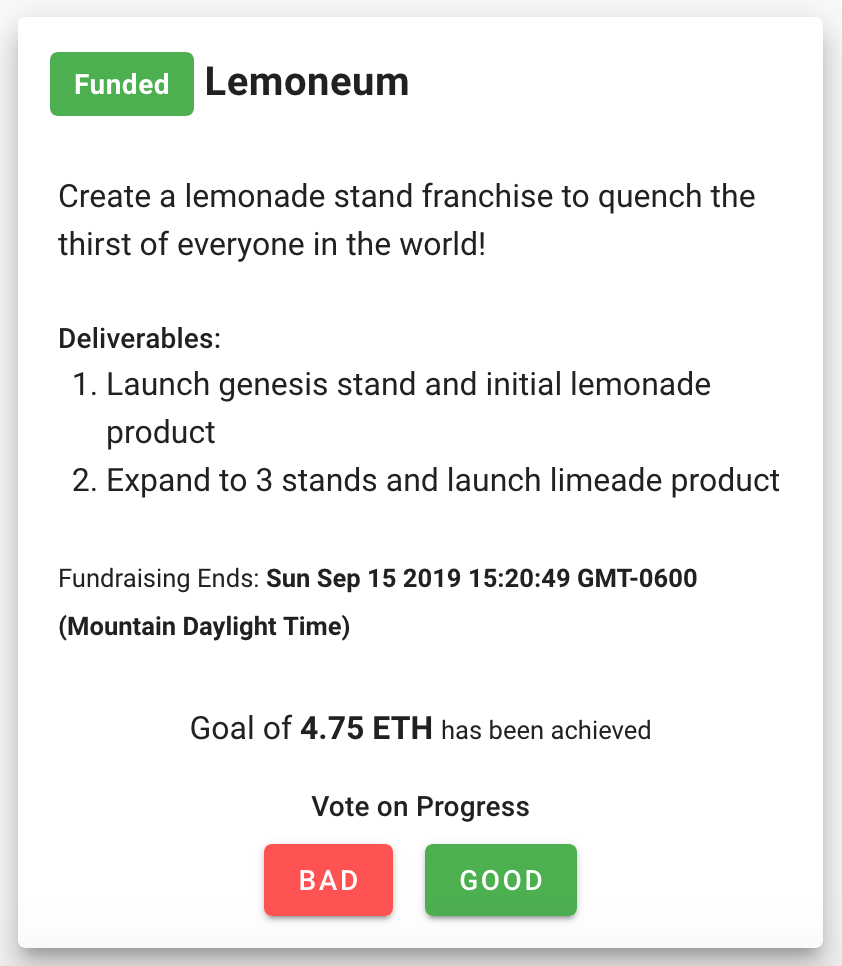
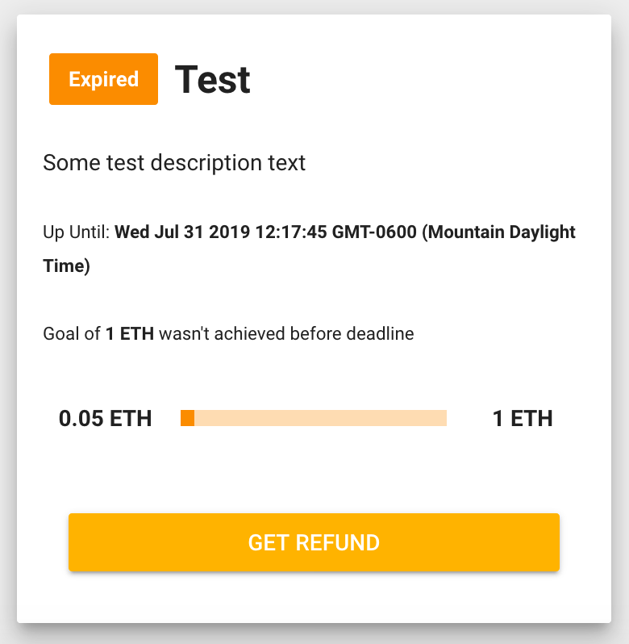
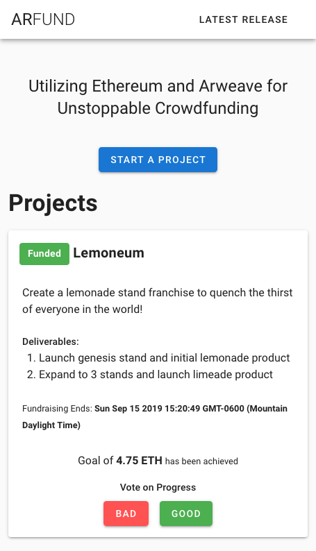

# ArFund

[Live on Ropsten and Arweave!](https://arweave.net/w3xNmDX3Vqcj1FTiKd0cKln1Vvnv7veUZ5Yd9d7toeQ)

## Challenge Description

The challenge was to create a crowdfunding application where the backend is an Ethereum smart contract, and the frontend is an application hosted on Arweave. This creates a completely decentralized crowdfunding app with a verifiable and immutably published project plan.

Current crowdfunding platforms have a problem. Creators ask for funds to complete a project, but once funded, we don’t always see the expected results. This new crowdfunding app should work to prevent this.

The creator asking for funds sets a deadline for raising 100% of the funds. The funds are split into creator-defined batches, with each batch being linked to a milestone. If the full amount isn't raised, the balance is refunded to the project backers.

### Once fully funded, the project starts:

- The first batch of funds is released to the creator to start the project.

- If a majority of backers are unsatisfied with the progress, they can then vote to suspend the project, stop future payouts, and return the remaining funds to the backers. If completed, the next batch is released to the creator.

- The same rules are followed until all milestones are completed, and all funds have been distributed, or until backers vote to suspend the project.

## Take a quick tour:

To start...

Create a new project:

Boom! You're off to the fundraises _(bad dad joke)_.

You can also fund other's projects.

Once a project's funding goal is reached, the first batch of funds is released and work begins!

If you contributed to a funded project, participate in the governance of releasing funds for milestones.

If a project's fundraising expires - or a majority of project contributors are dissatisfied with progress - funds are refunded.

One last goodie, ArFund is mobile friendly - allowing for simple fundraising from any device!

### Developer

[Tommy Cox](https://github.com/proofoftom) - @proofoftom
